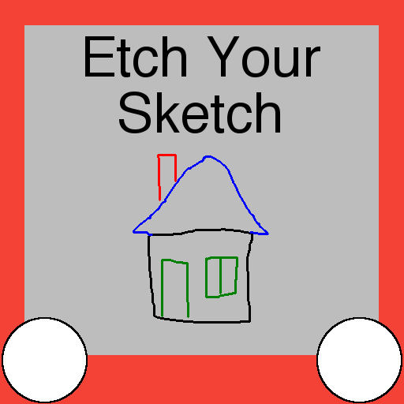
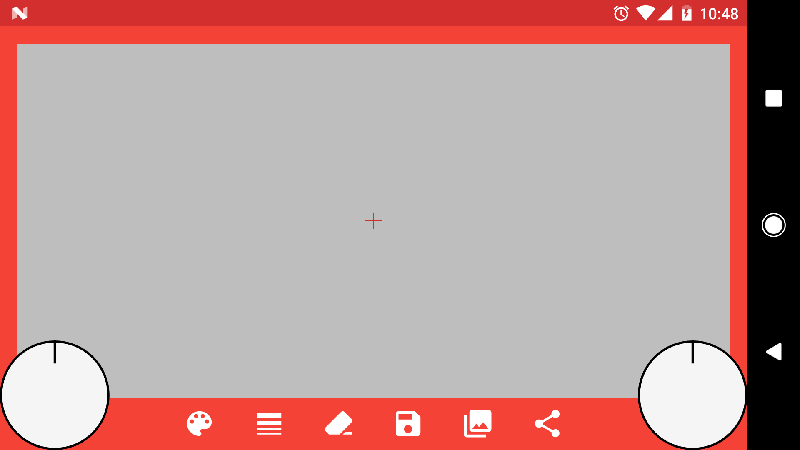
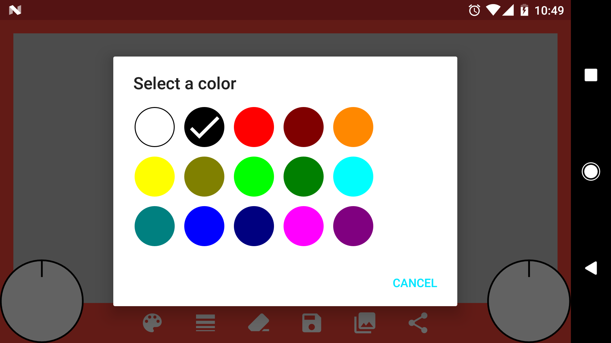
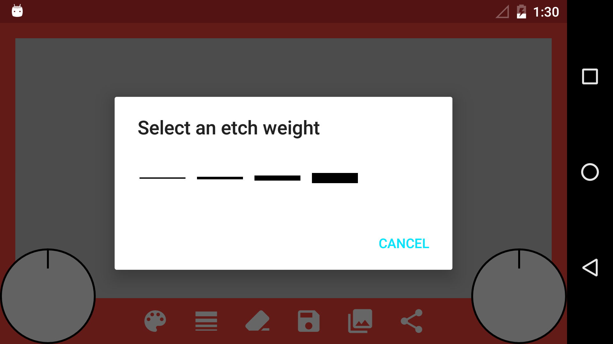
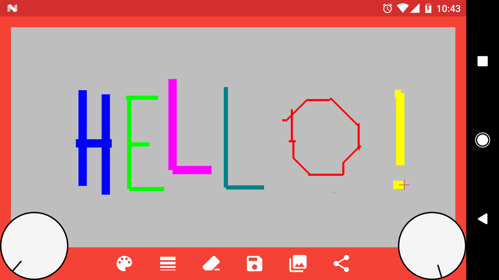
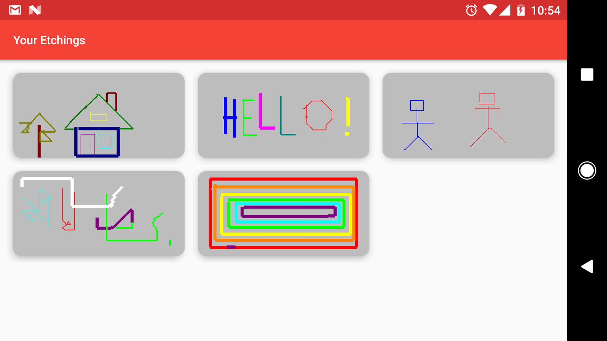

#  Etch-Your-Sketch

Inspired by the classic analog etching toy, this app lets you use two knobs to sketch anything you can imagine. 

This app was a good opportunity to implement some custom Android views for the knobs/dials, use the accelerometer to detect shaking, and use FileProvider to share content to other apps.
The user’s etchings are rendered to the screen using Android’s Canvas and SurfaceView APIs.

Features include:
- Change colors & line widths
- Precision erasing - or shake your phone to erase the whole thing (of course!)
- Save your etchings to your gallery
- Share your etchings to social media, messaging apps, etc.

#### Try it out!

*Google Play and the Google Play logo are trademarks of Google Inc.*

#### Screenshots

